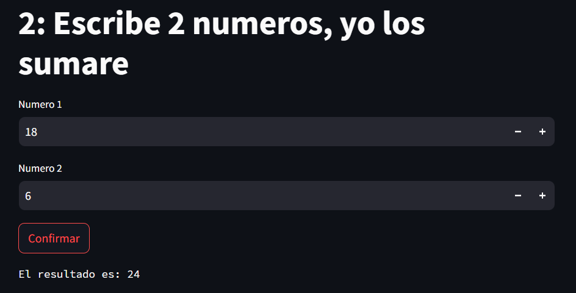

# streamlit-thingy
## Una aplicacion "Web" de prueba usando streamlit
## Por: Gonzalez Polanco Efrain Jafet 2°B
### DESCRIPCION
#### En este repositorio, se muestra el codigo fuente de una pagina web hecha con la libreria de python 'Streamlit'.

#### Su funcionamiento se logra ver [aqui](https://app-thingy-naxdpkjdq7tcutrb5a3twv.streamlit.app/)

### CARACTERISTICAS
#### En esta pagina web hay 10 mini programas funcionales, los cuales se pueden usar a libertad por cualquiera que vea dicha pagina.

## EJEMPLO DE USO:

